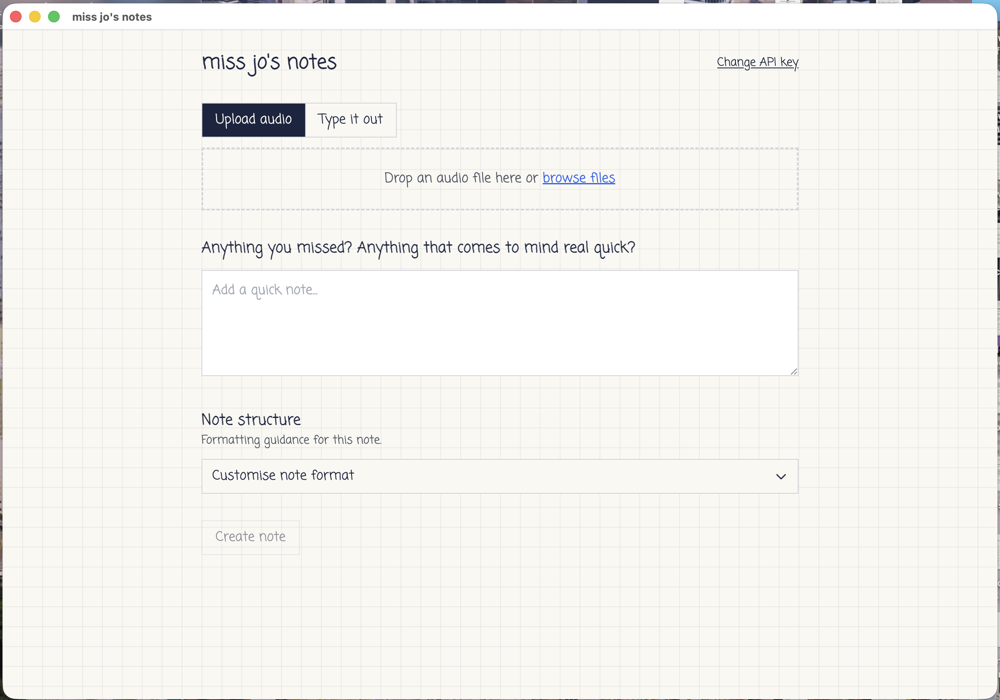

# miss jo's notes

Made this for a girl I like. She's an occupational therapist.

It turns voice memos or rough typed notes into structured session notes, so there's less time spent writing everything up. Upload audio or type it out, add anything you missed, then create and copy the note. You can customise the format too.

Built with React, TypeScript, Python/FastAPI and Electron. Uses OpenAI for transcription and note generation.
